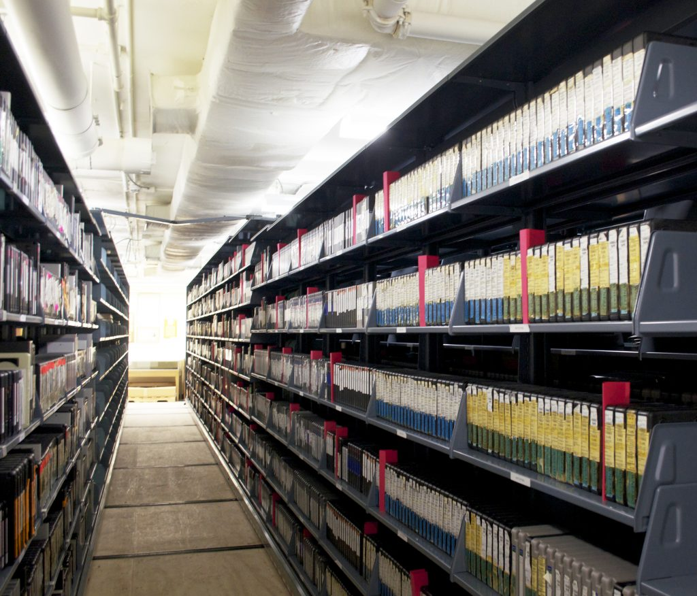

## Samvera Case Study – Avalon @ University of Houston

### Overview

With more than 45,000 students and 17 colleges, the University of Houston (UH) is a growing, international campus.  Categorized as a R1 institution, UH is home to a wide variety of research faculty and staff in innumerable fields of inquiry.  As a member of the ARL, UH Libraries host significant collections, including repositories for scholarly works of UH faculty and students.  Further, the library serves as a cultural archive for Houston, one of the largest cities in the United States, serving the six-million residents of the Houston metro area and beyond.

### Situation

For more than a decade, UH Libraries has worked with a variety of technologies to bring the collections and works of the institution to the public.  Efforts have included development of consortia for state-wide Software as a Service (SaaS) digital scholarship technologies, as well as adoption of a variety of services for management of collections, from research data to photography collections.  UH Libraries also contain vast media holdings, including local broadcast, oral histories, public television archives, and more.

With a strong technical team in place and a rededication to community efforts beyond the Lone Star State, UH has recently led grant work toward development of systems for migrating content from existing repository systems to HyKu, a multitenant turnkey installation of the Samvera repository solution, Hyrax.

As the UH Libraries continue to expand and develop collections, several forces are at work.  Policy and management changes of commercial SaaS repository solutions used to host media content have driven reconsideration of platform, better integration with other repository platforms and an increased demand for the content currently only available via aging streaming technologies or on technologies that have not yet been prepared for streaming distribution, either in analog or digital formats.

### Challenge

For the past several years, UH has utilized multiple platforms for repository technologies.  Audio and video content was served from a SaaS commercial platform.  While stable, the platform had difficulties integrating with UH identity management systems, and was unable to provide a modern streaming experience, often requiring intervention and assistance from library staff.

Patrons found searching for content located in the existing system difficult, requiring time-consuming communication with the library’s Media Specialist.  Once items were located, the outdated delivery of the media could similarly prove difficult to navigate without assistance.  Embedding content into websites such as Omeka proved inefficient and challenging, causing significant overhead and effort.

Of related concern, over time, media in physical formats - whether film, videotape or disk - will see a deterioration of quality of the source materials, leading to a degree of degradation that prohibits use.  Holding a single copy of physical media creates a vulnerability in case of disaster or merely from the changes that can occur given time and delicate media.

Due to budgetary and staffing constraints, UH had not been able to immediately address digitization of their physical collections.

As UH looked to expand their digitization efforts into video and audio, they would need to consider the destination for the video and audio, and they chose to make a decision regarding a repository for audio and video prior to digitization in order to forego a labor-intensive migration effort.  With no path toward resolving poor user and patron experiences in sight with their existing content management system, UH Libraries began considering more ideal solutions.

### Solution

Any new system chosen by UH would need to provide a modern streaming experience, manage metadata in ways familiar to librarians and archivists, demonstrate sustainability as a technology and not create an undue burden upon local technology teams.

Avalon Media System is built using the Samvera Framework, a collection of components developed within the Samvera Community that can be used to develop customized repository solutions while also sharing a common underlying infrastructure.  As an extension of the Samvera Framework, users of Avalon can trust that the system enjoys robust support from well-supported digital library programs with needs similar to those of UH.  This dedicated Community is comprised of a network of developers, system administrators, metadata experts and repository managers working in cooperation.

With the challenges to the longevity of physical media in mind, digitizing physical media and migrating to Avalon Media System created an option for transforming archives of audio and video recordings which languished in their original formats (VHS, ¾” tape, audio tape) into digital files which can exist beyond the duration of the physical media.  Migration of file-types and standard preservation and back-up practices will ensure the media will enjoy a longer life if action is taken to migrate content to modern formats at relevant points in the future.

Access to media within Avalon, whether via viewing media within a local installation of Avalon, embedded into a website or integrated into a learning management system, users receive an intuitive, straightforward experience.  Media housed in Avalon can be used and reused with the features the Avalon team continues to develop.  Further, the local GUI for Avalon management is an exceedingly straightforward interface.

For System Administrators and Developers, as a Samvera solution bundle, those already familiar with the common core technologies of Samvera can more easily manage a single technology stack.

And, of course, once the items are online and searchable, the potential for reaching a global audience would meet the mission of UH Libraries as they could now share the unique holdings that highlight Houston’s historical record and cultural artefacts.

UH has been able to deploy Avalon Media System for local use, bringing archives of local media to the public.  Emily Vinson, audio and video archivist for UH said, “The Avalon platform allowed our users to discover and access our moving image collections in a way that had not previously been possible. An increased focus on digitization, coupled with this improved access, has resulted in a significant increase in reference requests and website traffic for the collections featured on our Avalon instance.”

With the selection and implementation of Avalon, the University of Houston has begun the process of digitizing their large holdings of media, and, already, have seen growth in discovery and usage of media that was unavailable without significant labor and challenges to both the patron and library.

As a recognized Samvera solution bundle for audio and video content, and with years of support from Indiana and Northwestern Universities, Avalon Media System has continued to grow as an application with an active development team continuing to enhance and re-architect Avalon to meet the needs of libraries, archives, and museums.  Avalon has paired with organizations such as Artefactual, AVP, Digirati and others to develop additional features for preservation, OHMS integration, and mark-up of audio files.  As an open source application, UH could choose to develop features with the Avalon team or as pull-requests to be incorporated at a later date.

In short, Samvera with Avalon components integrated, may provide users with a robust repository solution providing for a full range of services and media types, but not require staff to learn or use multiple systems to achieve their goals.

_Physical AV resources in the stacks_

##### 
